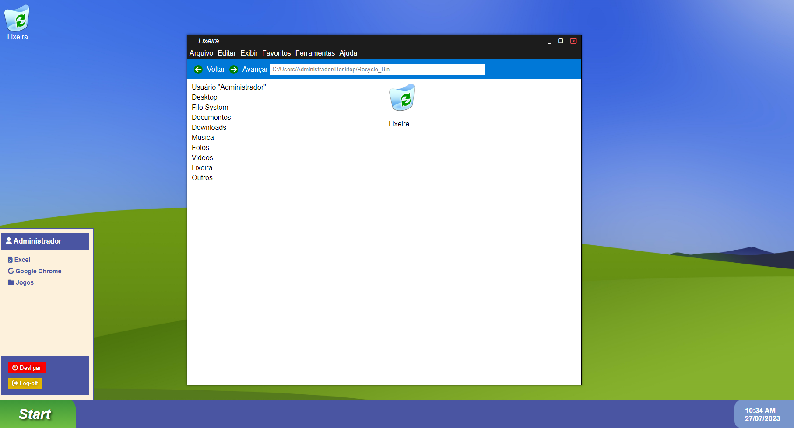

# Sistema Operacional Web - Janelas 69
Este projeto é um Sistema Operacional Web inspirado no Windows XP, permitindo que você interaja com a área de trabalho, abra e feche janelas e explore os ícones e pastas disponíveis.

## Tecnologias Utilizadas

- HTML
- CSS
- JavaScript

## Como Utilizar

1. Faça um clone deste repositório para a sua máquina local.
2. Abra o arquivo `index.html` em seu navegador web.
3. A área de trabalho será carregada com os ícones disponíveis.
4. Para abrir uma janela, clique duas vezes no ícone correspondente.
5. Para fechar uma janela, clique no botão de fechar uma vez.
6. Utilize os botões de minimizar e maximizar para gerenciar as janelas abertas.

## Funcionalidades Implementadas

- Ícones na área de trabalho representando pastas e programas.
- Modelo de janela para abrir e fechar pastas.
- Barra de tarefas com menu Iniciar, relógio e opções de desligar e fazer logoff.

## Próximas Etapas (Project_VPX: 1.2)

- Implementar mais funcionalidades nas pastas e programas.
- Melhorar a interface do usuário e a logo.
- Adicionar suporte para arrastar e redimensionar as janelas.
- Adicionar pastas e subpastas com conteúdos escondidos dentro delas.

## Contribuição

Contribuições são bem-vindas caso você deseja contribuir para o projeto!

## Licença

Este projeto está sob a licença [MIT](LICENSE). Sinta-se à vontade para usar, modificar e distribuir conforme os termos da licença.

## Capturas de Tela

---

*Nota*: Este projeto é apenas para fins educacionais e não tem nenhuma afiliação com o Windows XP ou qualquer sistema operacional real. É uma recriação para fins de aprendizado e diversão.
